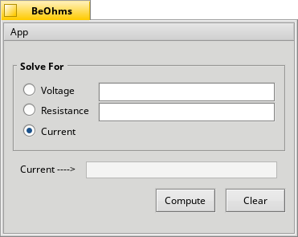

Quick Vocab:

<ul>
  <li>Voltage - the difference in charge between two points</li>
  <li>Current - the rate of charge flowing</li>
  <li>Resistance - a material’s tendency to resist the flow of charge</li>
</ul>

Intro: 

BeOhms is a calculator that is based off of Ohm's Law. This calculator solves for either voltage, resistance, or current:
given two of the variables. This simple application allows for the user to understand electricity by showing the differences
between the current and resistance. Ohm's Law is found on the equate "ΔV = I • R" where ΔV is voltage, I is current, and R is
resistance.

